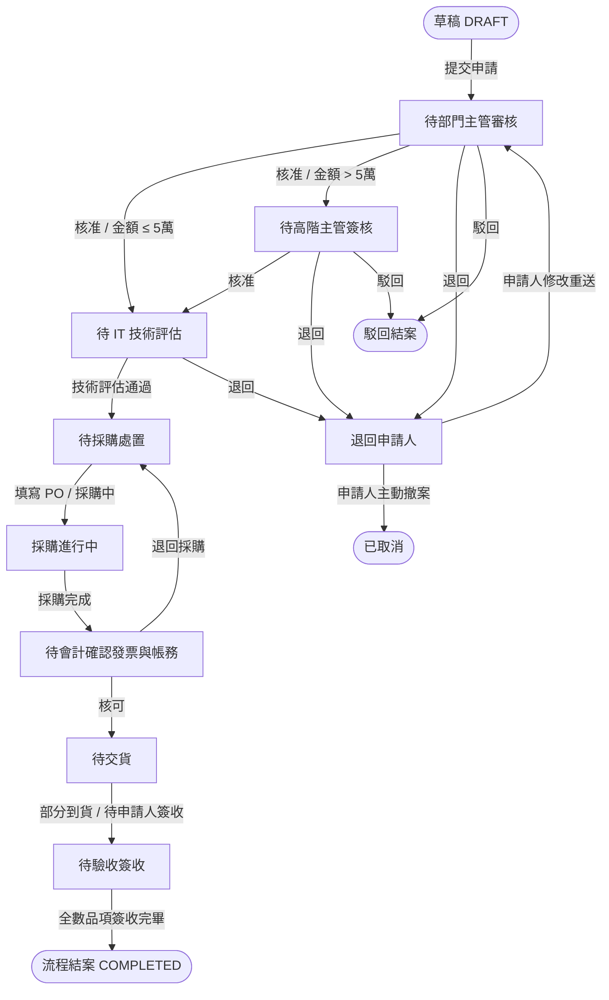

# 企業級 IT 設備申購與多角色簽核工作流模組
## Enterprise IT Equipment Procurement & Approval Workflow Module

[](https://www.typescriptlang.org/)
[](https://nestjs.com/)
[](https://react.dev/)
[](https://vitejs.dev/)
[](https://tailwindcss.com/)
[](https://www.prisma.io/)
[](https://www.mysql.com/)
[](https://www.docker.com/)
[](https://cloud.google.com/)

本專案為一個針對**企業內部資訊設備請購與簽核工作流（Internal IT Procurement & Approval Workflow）**實作之模組原型與參考架構。

系統以現代化全端架構實作，涵蓋**狀態機工作流引擎**、**RBAC 多角色權限控管**、**審計日誌時間軸**與**品項級分批驗收機制**，並支援以 **Docker 一鍵容器化**部署至本機或 GCP（Google Cloud Platform）環境進行展示。

---

## 目錄

- [一、 系統架構與設計理念](#一-系統架構與設計理念)
- [二、 簽核工作流狀態機](#二-簽核工作流狀態機)
- [三、 系統邊界與模擬實作說明](#三-系統邊界與模擬實作說明)
- [四、 一鍵快速啟動 (Quick Start)](#四-一鍵快速啟動-quick-start)
- [五、 預設測試角色與帳號](#五-預設測試角色與帳號)
- [六、 雲端容器化部署指南 (GCP Cloud Ready)](#六-雲端容器化部署指南-gcp-cloud-ready)

---

## 一、 系統架構與設計理念

本專案採用 **Monorepo** 架構，模組分工明確，具備高內聚、低耦合與獨立建置能力：

```
internal-procurement-workflow-module/
├── apps/
│   ├── api/                 # 後端服務 (NestJS + TypeScript + Prisma ORM)
│   │   ├── src/             # 控制器、業務邏輯、權限 Guard、工作流引擎
│   │   └── Dockerfile       # 後端多階段容器構建檔
│   └── web/                 # 前端介面 (React 19 + Vite + TailwindCSS v4 + Zustand)
│       ├── src/             # UI 元件、審批時間軸、水平管道、自訂 Hooks
│       ├── nginx.conf       # 靜態託管與 /api 反向代理設定
│       └── Dockerfile       # 前端 Nginx 容器構建檔
├── prisma/
│   ├── schema.prisma        # 資料庫資料模型定義 (Data Schema)
│   └── seed.ts              # 測試假資料初始化腳本 (Idempotent Seed)
└── docker-compose.yml       # 全包式一鍵容器編排 (MySQL + API + Web)
```

### 技術堆疊 (Tech Stack)

- **後端 (Backend)**：Node.js、NestJS 11、TypeScript、Prisma ORM
- **前端 (Frontend)**：React 19、Vite 8、TailwindCSS v4、Zustand（輕量化全域狀態）、Lucide Icons
- **資料庫 (Database)**：MySQL 8.0（Prisma 自動遷移與關聯管理）
- **容器化與網路 (Container & Networking)**：Docker、Docker Compose、Nginx 反向代理

---

## 二、 簽核工作流狀態機

系統實作了嚴謹的狀態轉換與金額門檻路由：



### 核心功能亮點：
1. **RBAC 多角色操作面板**：系統依據目前登入者角色與申請單當前狀態，動態渲染專屬操作（如同意、退回、駁回、採購下單、品項驗收）。
2. **視覺化水平流程圖 (Horizontal Pipeline)**：清晰展示目前案件所處階段、下一站負責人與歷史軌跡。
3. **明細級分批到貨與簽收 (Batch Receiving)**：採購單內多個設備可獨立更新到貨狀態，申請人可針對已到貨項目進行獨立簽收，貼近企業實務需求。
4. **全歷程審計時間軸 (Audit Trail)**：自動記錄每個節點的處理人、角色、處理時間、前置/後置狀態與備註意見。
5. **站內即時通知系統 (Notification Bell)**：單據狀態變更時，自動推播站內通知給相關權責人員。

---

## 三、 系統邊界與模擬實作說明

本專案專注於**「請購與簽核工作流模組本身」**的核心邏輯與狀態轉換，針對大型企業中相鄰之周邊系統，定義了清晰的架構邊界與模擬邊界：

| 邊界範疇 | 實作狀態 | 架構邊界說明 |
| :--- | :---: | :--- |
| **工作流狀態機與審計** | ✅ **完整實作** | 涵蓋草稿、主管審批、高階加簽、IT 評估、採購、會計與驗收完整生命週期。 |
| **RBAC 權限與操作控制** | ✅ **完整實作** | 各角色嚴格限制操作邊界，後端 Guard 與前端動態面板雙重驗證。 |
| **品項分批驗收與簽收** | ✅ **完整實作** | 明細層級獨立追蹤交貨狀態與簽收時間戳記。 |
| **HR / 組織架構資料** | 🔄 **Mock 模擬** | 以資料庫 Seed 模擬部門層級、主管與從屬關係。 |
| **外部 ERP / 採購單拋轉** | 🔄 **Mock 邊界** | 系統已留存 `poNumber`、`supplierName`、`actualUnitPrice` 等標準對接欄位，作為對外 ERP 介接樁。 |
| **外部通知渠道 (Email/Slack)** | 🔄 **Stub 預留** | 站內鈴鐺通知完整實作；後端已預留外部郵件發送接口樁（Stub）。 |

---

## 四、 一鍵快速啟動 (Quick Start)

### 方式 A：Docker 一鍵啟動全套（⭐ 最推薦，展示用）

只需安裝 Docker 與 Docker Compose，無需配置 Node.js 或 MySQL 環境：

```bash
# 1. 複製並啟動容器 (自動構建前端、後端與 MySQL，並自動執行 Migration 與假資料 Seed)
docker compose up -d --build

# 2. 開啟瀏覽器訪問
# 前端介面（經 Nginx 自動反向代理 API）：http://localhost
# 後端 API 埠：http://localhost:3000
```

> 容器啟動時，`api` 容器內置的 entrypoint 腳本會自動等待 MySQL 就緒，同步資料庫結構並自動寫入預設測試帳號與設備假資料。

---

### 方式 B：本地獨立開發模式 (Local Development)

若需要修改程式碼並即時熱重載：

#### 1. 環境需求
- Node.js >= 20
- Docker（用於在本機快速起 MySQL）

#### 2. 安裝與執行步驟
```bash
# 1. 複製環境變數設定檔
cp .env.example .env

# 2. 啟動本機 MySQL 資料庫 (運行於 3307 埠，避免與現有 MySQL 衝突)
docker compose up -d mysql

# 3. 安裝相依套件
npm install
cd apps/api && npm install && cd ../..
cd apps/web && npm install && cd ../..

# 4. 資料庫結構同步與 Seed 假資料
npx prisma db push
npx prisma db seed

# 5. 一鍵啟動前後端開發熱重載
npm run dev
# 前端：http://localhost:5173
# 後端：http://localhost:3000
```

#### 3. 前後端獨立 Build 驗證
```bash
# 於根目錄執行一鍵建置
npm run build
```

---

## 五、 預設測試角色與帳號

為方便展示與體驗多角色簽核流程，系統內建 **Mock 快速切換機制**：
- **入口頁面 (`/login`)**：可直接點選各角色卡片快速登入。
- **頂部 Header 快捷下拉選單**：登入後可隨時切換角色，無需反覆登出，可於送出申請後直接變身主管進行簽核。

| 角色 (Role) | 預設姓名 | 帳號 (Email) | 負責功能與權限範疇 |
| :--- | :--- | :--- | :--- |
| **員工 (EMPLOYEE)** | Alice | `emp_alice@example.com` | 建立請購表單、查看個人申請案、商品到貨簽收 |
| **部門主管 (MANAGER)** | Bob | `mgr_bob@example.com` | 審核所屬部門同仁的請購申請、退回或駁回 |
| **高階副總 (VP / MANAGER)** | Clark | `vp_clark@example.com` | 加簽高額請購單（總金額大於 NT$ 50,000） |
| **IT 技術主管 (IT)** | David | `it_david@example.com` | 設備規格與技術相容性審核、填寫評估意見 |
| **採購專員 (PROCUREMENT)** | Emma | `proc_emma@example.com` | 填寫採購 PO、廠商報價與登記品項交貨狀態 |
| **會計專員 (ACCOUNTING)** | Frank | `acct_frank@example.com` | 核對發票號碼、確認請購預算代碼並核可結案 |

---

## 六、 雲端容器化部署指南 (GCP Cloud Ready)

本專案經過完整容器化封裝，能以極低成本甚至 **$0 終身免費** 部署在 Google Cloud Platform (GCP)：

### 建議架構：GCP Compute Engine (`e2-micro`) 終身免費方案
1. **建立 GCP 虛擬主機**：
   - 於 GCP Console 建立一台 **Compute Engine VM**。
   - 地區選擇美區（如 `us-central1` 或 `us-west1`），機器類型選 `e2-micro`（符合 GCP Always Free 永久免費條件）。
   - 防火牆勾選 **「允許 HTTP 流量（Port 80）」**。
2. **在 VM 內部署**：
   ```bash
   # 安裝 Docker 與 Docker Compose
   sudo apt-get update && sudo apt-get install -y docker.io docker-compose
   
   # Clone 專案
   git clone https://github.com/doriskuo/internal-procurement-workflow-module.git
   cd internal-procurement-workflow-module
   
   # 一鍵啟動
   sudo docker-compose up -d --build
   ```
3. **展示成果**：
   - 直接在外部瀏覽器輸入 VM 的外部 IP（`http://<YOUR_VM_EXTERNAL_IP>`），即可對外展示完整的全端系統。
